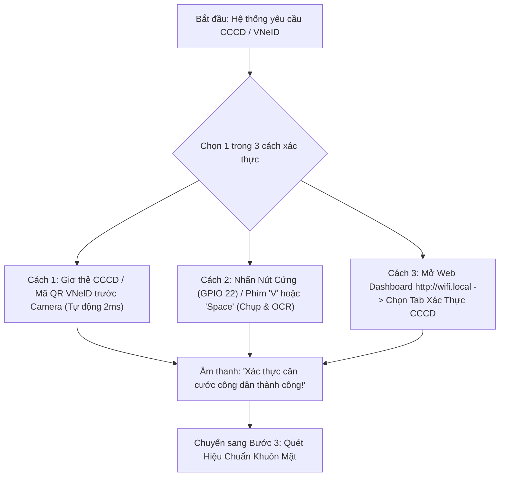

# 🚗 AI Driver Monitoring System (AI_DMS)
### Hệ Thống Giám Sát Tài Xế & Cảnh Báo An Toàn Thời Gian Thực Bằng Trí Tuệ Nhân Tạo

[](https://www.python.org/)
[](https://ubuntu.com/)
[](LICENSE)

**AI_DMS** là giải pháp IoT nhúng kết hợp Trí tuệ Nhân tạo (Computer Vision & Deep Learning) nhằm giám sát hành vi, phát hiện tức thì các dấu hiệu nguy hiểm của người lái xe như **buồn ngủ, vi giấc ngủ (microsleep), ngáp liên tục, mất tập trung hoặc cúi/ngoảnh mặt**.

Hệ thống được thiết kế để vận hành độc lập trên xe (**Headless - không bắt buộc cần màn hình lớn**), tự động quản lý kết nối mạng, phát âm thanh cảnh báo bằng **giọng nói Tiếng Việt**, hiển thị trạng thái qua **màn hình phụ OLED mini**, ghi âm khoang lái, gửi cảnh báo tức thì về điện thoại qua **Telegram Bot**, và cung cấp trang **Web Dashboard** quản lý hành trình trên tên miền cố định **`http://wifi.local`**.

---

## 📑 Mục Lục
1. [Tính Năng Nổi Bật](#-tính-năng-nổi-bật)
2. [Cấu Trúc Thư Mục](#-cấu-trúc-thư-mục)
3. [Danh Mục Linh Kiện & Sơ Đồ Đấu Nối Phần Cứng](#-danh-mục-linh-kiện--sơ-đồ-đấu-nối-phần-cứng)
4. [Hướng Dẫn Cài Đặt Từng Bước (Dành Cho Người Mới)](#-hướng-dẫn-cài-đặt-từng-bước-dành-cho-người-mới)
5. [Kiểm Tra & Chẩn Đoán Phần Cứng](#-kiểm-tra--chẩn-đoán-phần-cứng)
6. [Hướng Dẫn Quy Trình Vận Hành Thực Tế (Từ A - Z)](#-hướng-dẫn-quy-trình-vận-hành-thực-tế-từ-a---z)
   * [Bước 1: Bật Nguồn & Kết Nối Wi-Fi / Web](#bước-1-bật-nguồn--kết-nối-wi-fi--web)
   * [Bước 2: Xác Thực Tài Xế (CCCD / VNeID - 3 Cách)](#bước-2-xác-thực-tài-xế-cccd--vneid---3-cách)
   * [Bước 3: Hiệu Chuẩn & Xử Lý Lỗi Khuôn Mặt](#bước-3-hiệu-chuẩn--xử-lý-lỗi-khuôn-mặt)
   * [Bước 4: Quá Trình Giám Sát Khi Lái Xe & Các Cấp Độ Cảnh Báo](#bước-4-quá-trình-giám-sát-khi-lái-xe--các-cấp-độ-cảnh-báo)
   * [Bước 5: Kiểm Tra Ghi Âm Khoang Lái & Báo Cáo Chuyến Đi](#bước-5-kiểm-tra-ghi-âm-khoang-lái--báo-cáo-chuyến-đi)
7. [Cấu Hình Cảnh Báo Telegram Bot](#-cấu-hình-cảnh-báo-telegram-bot)
8. [Hướng Dẫn Sử Dụng Web Dashboard (`http://wifi.local`)](#-hướng-dẫn-sử-dụng-web-dashboard-httpwifilocal)
9. [Xử Lý Lỗi Thường Gặp (FAQ & Troubleshooting)](#-xử-lý-lỗi-thường-gặp-faq--troubleshooting)

---

## 🌟 Tính Năng Nổi Bật

### 1. Nhận Diện Trạng Thái Tài Xế Bằng AI (Real-Time AI Detection)
* **MediaPipe Face Mesh 468 Điểm**: Trích xuất chính xác các mốc tọa độ mắt, miệng và góc xoay đầu 3 chiều (Pitch, Yaw, Roll).
* **Mô hình học sâu chuỗi thời gian PyTorch LSTM**: Phân biệt chuẩn xác giữa nháy mắt tự nhiên và nhắm mắt buồn ngủ theo thời gian thực.
* **Cơ chế hiệu chuẩn tự động (Auto Calibration)**: Tự động học kích thước mắt/miệng đặc thù của từng người lái xe trong 3-5 giây đầu tiên khi lên xe.
* **Đa tầng phát hiện nguy hiểm**:
  * 😴 **Buồn ngủ nhẹ (Level 1)**: Mắt nhắm liên tục $\ge 1.5$ giây.
  * 🚨 **Ngủ gật nguy hiểm / Vi giấc ngủ (Level 2 & 3)**: Mắt nhắm liên tục $\ge 3.0$ giây.
  * 🥱 **Ngáp liên tục**: Độ mở miệng (MAR) vượt ngưỡng an toàn trong thời gian dài.
  * 📱 **Mất tập trung**: Nghiêng đầu, cúi mặt nhìn điện thoại hoặc ngoảnh mặt khỏi hướng lái quá 2 giây.

### 2. Hệ Thống Cảnh Báo Đa Tầng (Multi-Modal Alerts)
* 🗣️ **Giọng nói Tiếng Việt tự nhiên**: Phát nhắc nhở qua loa Jack 3.5mm kết nối mạch khuếch đại TDA2050 (ví dụ: *"Cảnh báo: Bạn đang có dấu hiệu buồn ngủ, vui lòng tập trung lái xe!"*).
* 🔊 **Còi Bíp (Buzzer)**: Kích hoạt âm thanh tần số cao báo động thức giấc.
* 📳 **Động cơ rung (Vibration Motor)**: Gắn trên vô lăng hoặc ghế lái để cảnh báo xúc giác khi có nguy hiểm cấp cao.
* 🖥️ **Màn hình OLED mini 0.96 inch (SSD1306)**: Hiển thị liên tục chỉ số EAR/MAR, FPS, mức độ mệt mỏi (Fatigue Score) và trạng thái hệ thống.

### 3. Cảnh Báo Tức Thời Qua Telegram Bot
* Tự động chụp ảnh khuôn mặt vi phạm tại thời điểm nguy hiểm.
* Tự động thu âm đoạn âm thanh 10 giây trong cabin bằng micro trên camera USB.
* Gửi ngay lập tức ảnh chụp + file ghi âm + thông tin vi phạm (thời gian, loại lỗi) về nhóm/kênh Telegram của chủ xe hoặc người quản lý đội xe.

### 4. Tự Động Quản Lý Mạng & Web Portal Không Cần Màn Hình (Headless)
* **Auto-Hotspot thông minh**:
  * Khi ở nhà / văn phòng: Tự động kết nối Wi-Fi quen thuộc đã lưu.
  * Khi lên xe ô tô / mất sóng: Tự động chuyển sang phát trạm Wi-Fi **`AI_DMS_Hotspot`** (Mật khẩu: `1234567890`) trong vòng 3 giây.
* **Tên miền cố định qua mDNS**: Bất kể IP máy thay đổi thế nào, luôn truy cập được Web Dashboard qua địa chỉ duy nhất: **`http://wifi.local`** *(hoặc `http://dms.local`)*.
* **Web Dashboard Dark-Mode**:
  * Quản lý & xác thực CCCD/VNeID không cần màn hình lớn.
  * Xem nhật ký các chuyến đi (Driving Sessions), tổng thời gian lái, số lần vi phạm.
  * Nghe lại các file ghi âm cabin khi xảy ra vi phạm trực tiếp trên trình duyệt.
  * Tính điểm mệt mỏi (Fatigue Score) và đánh giá chuyến đi: 🟢 An toàn | 🟡 Cảnh báo | 🔴 Nguy hiểm.
  * Xuất báo cáo dữ liệu định dạng `.csv`.
  * Quét và kết nối mạng Wi-Fi xung quanh trực tiếp trên giao diện Web.
  * Cấu hình Telegram Bot và kiểm tra thử phần cứng (Test Loa, Còi, Rung, OLED, Ghi âm) ngay trên Web.

---

## 📂 Cấu Trúc Thư Mục

```text
AI_DMS/
├── drowsiness_detector.py # Chương trình AI nhận diện & điều khiển trung tâm
├── audio_manager.py       # Quản lý âm thanh Jack 3.5mm, TDA2050 & ghi âm Micro USB
├── oled_manager.py        # Driver I2C điều khiển màn hình OLED SSD1306 128x64
├── telegram_bot.py        # Xử lý gửi tin nhắn, ảnh và file ghi âm qua Telegram
├── wifi_dashboard.py      # Web Dashboard quản lý hành trình & cấu hình (Cổng 80)
├── mdns_publisher.py      # Dịch vụ định danh tên miền cố định wifi.local
├── setup_autohotspot.sh   # Script cài đặt tính năng tự động phát Wi-Fi Hotspot
├── run_dms.sh             # Script khởi chạy toàn bộ hệ thống với 1 lệnh
├── view_history.py        # Công cụ dòng lệnh xem & xuất dữ liệu lịch sử SQLite
│
├── lstm_model.py          # Kiến trúc mạng học sâu LSTM (PyTorch)
├── lstm_drowsiness.pth    # Trọng số mô hình LSTM đã huấn luyện
├── train_lstm.py          # Script thu thập dữ liệu & huấn luyện lại mô hình
│
├── audio_prompts/         # Thư mục chứa âm thanh còi bíp và giọng nói Tiếng Việt
├── camera_config.json     # Cấu hình Camera USB (Độ phân giải 1280x720, MJPG, 30 FPS)
├── calibration_config.json# Ngưỡng mắt/miệng sau khi hiệu chuẩn
├── telegram_config.json.example # File mẫu hướng dẫn cài đặt Telegram Bot
│
├── test_hardware.py       # Công cụ kiểm tra toàn diện phần cứng
├── test_speaker.py        # Kiểm tra riêng ngõ ra âm thanh & giọng nói
├── test_oled.py           # Kiểm tra riêng màn hình OLED 128x64
├── test_camera.py         # Kiểm tra riêng độ phân giải & FPS Camera USB
│
├── requirements.txt       # Danh sách thư viện Python cần thiết
├── summary.txt            # Tóm tắt kiến trúc kỹ thuật & sơ đồ chân
└── README.md              # Tài liệu hướng dẫn sử dụng chi tiết
```

---

## 🔌 Danh Mục Linh Kiện & Sơ Đồ Đấu Nối Phần Cứng

### 1. Danh Sách Linh Kiện Cần Chuẩn Bị
1. **Bo mạch máy tính**: Raspberry Pi 4 Model B (hoặc Raspberry Pi 3B+, Mini PC chạy Ubuntu).
2. **Nguồn cấp**: Củ nguồn Type-C chuẩn 5V - 3A hoặc 3.5A.
3. **Thẻ nhớ**: MicroSD dung lượng từ 32GB Class 10 trở lên.
4. **Camera & Micro**: Camera USB (Webcam UVC) có tích hợp micro.
5. **Màn hình OLED**: Module OLED 0.96 inch giao tiếp I2C (Chip SSD1306, 128x64 điểm ảnh).
6. **Còi Bíp**: Module Buzzer 5V chủ động (Active Buzzer Module).
7. **Động cơ rung**: Module rung 5V / 3.3V (Vibration Motor Module).
8. **Mạch khuếch đại âm thanh & Loa**: Mạch TDA2050 (hoặc PAM8403) kết nối loa qua ngõ Jack 3.5mm.
9. **Nút bấm hiệu chuẩn / Quét**: Nút nhấn nhả 2 chân (Push button).
10. **Dây cắm**: Bộ dây Dupont cắm testboard (Cái - Cái và Đực - Cái).

---

### 2. Bảng Sơ Đồ Đấu Nối Chân GPIO (Raspberry Pi 40-Pin Header)

| Thiết Bị / Module | Chân Trên Module | Nối Vào Chân Raspberry Pi | Vị Trí Chân Vật Lý (Pin No.) | Ghi Chú |
| :--- | :--- | :--- | :--- | :--- |
| **Màn Hình OLED** | **VCC** | Nguồn 3.3V | **Pin 1** (hoặc Pin 17) | Cấp nguồn 3.3V cho màn hình |
| *(SSD1306 I2C)* | **GND** | Nối Đất (Ground) | **Pin 9** (hoặc Pin 6, 14) | Nối cực âm |
| | **SDA** | **GPIO 2** (I2C1 SDA) | **Pin 3** | Chân truyền tín hiệu dữ liệu I2C |
| | **SCL** | **GPIO 3** (I2C1 SCL) | **Pin 5** | Chân truyền xung nhịp clock I2C |
| **Còi Bíp (Buzzer)** | **VCC / (+)** | Nguồn 5V | **Pin 2** (hoặc Pin 4) | Cấp nguồn 5V cho còi |
| | **GND / (-)** | Nối Đất (Ground) | **Pin 14** (hoặc Pin 20) | Nối cực âm |
| | **I/O (Signal)** | **GPIO 27** | **Pin 13** | Tín hiệu điều khiển đóng ngắt |
| **Động Cơ Rung** | **VCC** | Nguồn 5V / 3.3V | **Pin 4** (hoặc Pin 17) | Cấp nguồn cho motor rung |
| | **GND** | Nối Đất (Ground) | **Pin 20** (hoặc Pin 25) | Nối cực âm |
| | **IN (Signal)** | **GPIO 17** | **Pin 11** | Tín hiệu kích hoạt rung |
| **Nút Bấm Hiệu Chuẩn**| **Chân 1** | **GPIO 22** | **Pin 15** | Kéo lên nội trở (Pull-up) |
| *(Calibrate Button)*| **Chân 2** | Nối Đất (Ground) | **Pin 14** (hoặc Pin 9) | Khi bấm nút chân 1 nối GND |
| **Ngõ Ra Loa** | **Jack 3.5mm** | Cổng Jack 3.5mm Pi | Cổng tròn 3.5mm | Xuất âm thanh ra mạch TDA2050 |
| **Camera & Micro** | **Cáp USB** | Cổng USB 3.0/2.0 | Cổng USB trên Pi | Cắm trực tiếp cổng USB |

---

## 🛠️ Hướng Dẫn Cài Đặt Từng Bước (Dành Cho Người Mới)

### Bước 1: Chuẩn Bị Môi Trường Hệ Điều Hành
* Cài đặt hệ điều hành **Ubuntu 22.04 / 20.04 LTS (64-bit)** hoặc **Raspberry Pi OS (64-bit)** lên thẻ nhớ.
* Cấp nguồn cho thiết bị, mở ứng dụng **Terminal** (Dòng lệnh).

### Bước 2: Tải Mã Nguồn Về Máy
Nhập các lệnh sau vào Terminal và nhấn Enter:
```bash
cd ~
git clone https://github.com/trandat09062003/AI_DMS_ubu.git AI_DMS
cd AI_DMS
```

### Bước 3: Cài Đặt Các Gói Phụ Thuộc Của Hệ Thống Linux
Hệ thống cần các thư viện xử lý âm thanh ALSA, xử lý hình ảnh OpenCV, giao thức mạng mDNS và quét mã:
```bash
sudo apt update
sudo apt install -y python3-pip python3-venv libgl1 libglib2.0-0 portaudio19-dev \
                    libasound2-dev libzbar0 tesseract-ocr alsa-utils pulseaudio \
                    network-manager avahi-daemon i2c-tools
```

### Bước 4: Tạo Môi Trường Ảo Python & Cài Thư Viện
Tạo một môi trường Python độc lập để đảm bảo không bị xung đột phiên bản:
```bash
# 1. Khởi tạo môi trường ảo venv
python3 -m venv venv

# 2. Kích hoạt môi trường ảo
source venv/bin/activate

# 3. Cập nhật pip và cài đặt toàn bộ gói cần thiết
pip install --upgrade pip
pip install -r requirements.txt
```

### Bước 5: Kích Hoạt Giao Tiếp I2C Cho Màn Hình OLED (Trên Raspberry Pi)
Nếu bạn đang dùng Raspberry Pi, hãy bật cổng I2C:
```bash
sudo raspi-config
```
* Chọn mục **Interface Options** $\rightarrow$ chọn **I2C** $\rightarrow$ chọn **Yes** để kích hoạt $\rightarrow$ chọn **Finish**.
* Kiểm tra xem màn hình OLED đã được nhận diện chưa:
```bash
sudo i2cdetect -y 1
```
*(Nếu nhìn thấy số `3c` trong bảng hiển thị là màn hình đã nối dây thành công).*

---

## 🔍 Kiểm Tra & Chẩn Đoán Phần Cứng

Trước khi chạy hệ thống chính thức, bạn có thể chạy các công cụ kiểm tra tự động để đảm bảo mọi linh kiện hoạt động 100%:

### 1. Kiểm tra Loa & Giọng nói AI Tiếng Việt
```bash
source venv/bin/activate
python3 test_speaker.py
```
*Chương trình sẽ tự động tăng âm lượng, phát các tiếng còi bíp và giọng nói hướng dẫn tiếng Việt ra loa.*

### 2. Kiểm tra Màn hình OLED mini 128x64
```bash
python3 test_oled.py
```
*Màn hình OLED sẽ lần lượt hiển thị các biểu tượng và các trạng thái cảnh báo mẫu trong vòng 15 giây.*

### 3. Kiểm tra Camera USB & Micro Thu Âm
```bash
python3 test_camera.py
```
*Chương trình sẽ kiểm tra độ phân giải, tốc độ khung hình (FPS) và tự động chụp 1 ảnh mẫu để xác nhận camera hoạt động mượt mà.*

### 4. Kiểm tra Toàn Diện Toàn Bộ Phần Cứng (OLED + Loa + Còi + Rung + Màn hình)
```bash
python3 test_hardware.py
```

---

## 🚦 Hướng Dẫn Quy Trình Vận Hành Thực Tế (Từ A - Z)

Phần này hướng dẫn chi tiết từng thao tác thực tế từ khi cấp nguồn thiết bị cho đến khi kết thúc chuyến đi dành cho mọi đối tượng người dùng.

### Bước 1: Bật Nguồn & Kết Nối Wi-Fi / Web

1. **Cấp nguồn**: Cắm nguồn Type-C cho Raspberry Pi / Máy tính nhúng trên xe.
2. **Khởi chạy hệ thống**: 
   * Nếu đã cấu hình dịch vụ tự khởi động (Systemd Service): Hệ thống sẽ tự chạy ngầm sau 15-20 giây.
   * Nếu chạy bằng tay từ Terminal:
     ```bash
     cd ~/AI_DMS
     ./run_dms.sh
     ```
3. **Kết nối mạng Wi-Fi**:
   * Thiết bị sẽ tự động phát sóng Wi-Fi Hotspot:
     * **Tên Wi-Fi (SSID)**: `AI_DMS_Hotspot`
     * **Mật khẩu (Password)**: `1234567890`
   * Bạn lấy điện thoại hoặc laptop kết nối vào mạng Wi-Fi trên.
4. **Mở Web Dashboard**:
   * Mở trình duyệt (Chrome, Safari, Cốc Cốc) gõ địa chỉ: **`http://wifi.local`** *(hoặc `http://10.42.0.1`)*.

---

### Bước 2: Xác Thực Tài Xế (CCCD / VNeID - 3 Cách)

Khi khởi động, hệ thống sẽ phát âm thanh tiếng Việt:
> 🗣️ *"Vui lòng quét thẻ căn cước công dân hoặc ứng dụng VNeID."*
> Màn hình OLED sẽ hiển thị biểu tượng thẻ và dòng chữ: `VNeID / CCCD QR`.

Bạn có thể lựa chọn **1 trong 3 cách** sau để xác thực:



* **Cách 1 (Quét tự động bằng Camera - Khuyên Dùng)**:
  * Cầm thẻ Căn cước công dân (mặt có mã QR) hoặc mở mã QR trên ứng dụng **VNeID** trên điện thoại.
  * Giơ mã QR trước ống kính camera ở khoảng cách $15 - 25\text{ cm}$.
  * Thuật toán AI tự động quét mã QR cực nhanh (2ms), bóc tách số CCCD, họ tên và tự động chuyển bước.

* **Cách 2 (Nhấn nút chụp thủ công trên xe)**:
  * Đặt thẻ CCCD trước camera.
  * Nhấn **Nút bấm phần cứng trên xe (GPIO 22)** (hoặc nếu có bàn phím thì nhấn phím **`V`**, **`Space`**, **`Enter`** hoặc **`C`**).
  * Hệ thống phát 1 tiếng Bíp ngắn, chụp ngay 1 khung hình và đẩy vào luồng ngầm để AI OCR (Tesseract) đọc chữ và trích xuất thông tin.

* **Cách 3 (Xác thực không chạm qua Web `http://wifi.local`)**:
  * Mở điện thoại vào **`http://wifi.local`** $\rightarrow$ chọn tab **Xác Thực VNeID / CCCD**.
  * Bạn có 3 lựa chọn trên giao diện:
    1. **Chọn nhanh tài xế**: Bấm vào hồ sơ mẫu có sẵn (ví dụ: *Trần Văn Đạt*, *Nguyễn Văn An*,...).
    2. **Chụp/Tải ảnh CCCD**: Bấm nút *Chụp / Tải ảnh thẻ CCCD từ điện thoại* để hệ thống tự nhận diện.
    3. **Nhập trực tiếp**: Điền số CCCD và Họ tên rồi nhấn nút **Xác Thực Ngay**.

Sau khi xác thực CCCD thành công, loa phát âm thanh:
> 🗣️ *"Xác thực căn cước công dân và VNeID thành công!"*
> Hệ thống tự động tạo mã phiên lái xe mới (Session ID) trong cơ sở dữ liệu và chuyển sang bước nhận diện khuôn mặt.

---

### Bước 3: Hiệu Chuẩn & Xử Lý Lỗi Khuôn Mặt

Sau khi xác thực CCCD xong, loa sẽ phát thông báo:
> 🗣️ *"Vui lòng nhìn thẳng vào camera để xác thực khuôn mặt."*
> Màn hình OLED hiển thị thanh tiến trình hiệu chuẩn: `DANG QUET... [%]`.

#### 1. Thao tác chuẩn:
* Tài xế ngồi vào ghế lái với tư thế lái xe thoải mái, mắt mở bình thường và nhìn thẳng về phía kính chắn gió / camera trong **3 - 5 giây**.
* Hệ thống sẽ tự động học các chỉ số sinh trắc học cá nhân của bạn:
  * `EAR Baseline`: Độ mở mắt tự nhiên của bạn.
  * `MAR Baseline`: Độ khép miệng tự nhiên.
  * `Pitch / Yaw / Roll Baseline`: Góc nghiêng đầu chuẩn khi nhìn đường.
* Khi thanh tiến trình đạt $100\%$, loa phát:
  > 🗣️ *"Xác thực khuôn mặt thành công. Chúc bạn lái xe an toàn."*
  > Màn hình OLED chuyển sang giao diện đo lường thời gian thực. Hệ thống chính thức bước vào chế độ bảo vệ an toàn!

#### 2. Xử lý các lỗi khuôn mặt thường gặp:

| Hiện Tượng / Lỗi | Nguyên Nhân | Cách Xử Lý Nhanh |
| :--- | :--- | :--- |
| **Màn hình OLED báo `NO FACE` & còi bíp ngắt quãng** | Camera bị lệch góc, tài xế quay đi hướng khác hoặc ánh sáng quá tối. | 1. Chỉnh lại góc quay camera hướng thẳng vào mặt người lái.<br>2. Bật đèn cabin nếu lái xe ban đêm trong điều kiện tối hoàn toàn. |
| **Muốn quét lại khuôn mặt (Do lúc đầu ngồi sai tư thế / Đổi người lái)** | Lúc hiệu chuẩn ban đầu tài xế vô tình nhắm mắt, cúi đầu hoặc đeo khẩu trang/kính râm. | **Nhấn Nút Bấm Phần Cứng (GPIO 22)** một lần (hoặc nhấn phím **`r`** trên bàn phím, hoặc bấm nút **Quét Lại Khuôn Mặt** trên Web).<br>👉 *Hệ thống sẽ giữ nguyên thông tin CCCD và phiên lái xe hiện tại, chỉ quét lại tư thế khuôn mặt trong 3 giây.* |
| **Nhận diện sai tỷ lệ nhắm mắt (Cảnh báo nhầm)** | Ngưỡng mắt ban đầu bị lệch do ánh sáng môi trường thay đổi đột ngột. | Nhấn nút **GPIO 22** (hoặc phím **`r`**) để hệ thống tự động tái hiệu chuẩn lại ngưỡng nhắm mắt trong 3 giây. |

---

### Bước 4: Quá Trình Giám Sát Khi Lái Xe & Các Cấp Độ Cảnh Báo

Trong suốt hành trình, AI DMS hoạt động ngầm liên tục 30 FPS để bảo vệ bạn qua 4 cấp độ:

```text
+-----------------------------------------------------------------------------------------+
| [CẤP ĐỘ 0 - AN TOÀN]: Tài xế tỉnh táo, tập trung nhìn đường                             |
| -> Màn hình OLED hiển thị chỉ số EAR/MAR, FPS mượt mà. Hệ thống hoàn toàn im lặng.       |
+-----------------------------------------------------------------------------------------+
                                           |
                                           v (Khi phát hiện dấu hiệu bất thường)
+-----------------------------------------------------------------------------------------+
| [CẤP ĐỘ 1 - CẢNH BÁO NHẸ]: Nhắm mắt liên tục >= 1.5s hoặc Ngáp dài                     |
| -> OLED chuyển sang màu cảnh báo.                                                       |
| -> Loa phát giọng nói Tiếng Việt: "Nhắc nhở: Bạn đang có dấu hiệu buồn ngủ/ngáp."       |
+-----------------------------------------------------------------------------------------+
                                           |
                                           v (Nếu tiếp tục nhắm mắt hoặc ngủ gật)
+-----------------------------------------------------------------------------------------+
| [CẤP ĐỘ 2 & 3 - BÁO ĐỘNG NGUY HIỂM / VI GIẤC NGỦ]: Nhắm mắt >= 3.0s hoặc Cúi mặt quá lâu|
| -> 🔊 Còi Buzzer 5V kêu dồn dập tần số cao để đánh thức tức thì.                       |
| -> 📳 Động cơ rung (Vibration Motor) kích hoạt rung mạnh vô lăng / ghế lái.             |
| -> 🗣️ Loa phát cảnh báo khẩn cấp âm lượng tối đa.                                       |
| -> 🎙️ Tự động kích hoạt Micro USB ghi âm 10 giây tiếng cabin làm bằng chứng.            |
| -> 📸 Tự động chụp ảnh khuôn mặt vi phạm + Gửi ngay qua TELEGRAM BOT cho người thân/chủ xe.|
+-----------------------------------------------------------------------------------------+
```

---

### Bước 5: Kiểm Tra Ghi Âm Khoang Lái & Báo Cáo Chuyến Đi

Sau khi chuyến đi kết thúc (hoặc bất kỳ lúc nào bạn dừng xe nghỉ ngơi), bạn có thể kiểm tra toàn bộ dữ liệu minh bạch qua Web Dashboard:

#### 1. Kiểm tra & Nghe lại các file Ghi Âm Khoang Lái:
1. Kết nối vào Wi-Fi `AI_DMS_Hotspot` $\rightarrow$ Mở `http://wifi.local`.
2. Chọn tab **Ghi Âm Khoang Lái (Audio Logs)**.
3. Danh sách các đoạn ghi âm 10 giây (khi xảy ra buồn ngủ 3s, mất tập trung hoặc reset hệ thống) sẽ xuất hiện với đầy đủ:
   * Tên file & Mốc thời gian chính xác (Ví dụ: `20260821_143000_drowsiness_3s_10s.wav`).
   * Sự kiện kích hoạt vi phạm.
   * Dung lượng tệp.
4. **Bấm nút Play (▶️)** trên trình duyệt để nghe lại trực tiếp âm thanh khoang lái trên điện thoại mà không cần cắm USB hay gõ lệnh.
5. Bạn cũng có thể bấm nút **🎙️ Ghi Âm Thử Nghiệm 10 Giây (Micro USB)** để test độ nhạy của micro bất cứ lúc nào.

#### 2. Kiểm tra Báo Cáo Hành Trình (Driving Sessions):
1. Chọn tab **Báo Cáo Chuyến Đi**.
2. Xem bảng tổng kết hành trình:
   * **Thông tin tài xế**: Họ tên, Số CCCD/VNeID.
   * **Thời gian**: Giờ bắt đầu, giờ kết thúc, tổng thời lượng lái xe.
   * **Số lần vi phạm**: Thống kê số lần nhắm mắt $\ge 3\text{s}$, số lần mất tập trung/nghiêng đầu, số lần ngáp.
   * **Chỉ số mệt mỏi (Fatigue Score)**: Điểm số mệt mỏi trung bình và đỉnh điểm.
   * **Đánh giá tự động**:
     * 🟢 **An toàn (Safe)**: Điểm mệt mỏi thấp, lái xe tập trung.
     * 🟡 **Cảnh báo (Warning)**: Có dấu hiệu ngáp nhiều hoặc buồn ngủ nhẹ, cần uống nước / nghỉ ngơi.
     * 🔴 **Nguy hiểm (Danger)**: Xuất hiện hiện tượng ngủ gật $\ge 3\text{s}$, cần dừng xe ngay lập tức.
3. **Xuất báo cáo**: Nhấn nút **📥 Xuất File CSV** để tải file báo cáo định dạng Excel/CSV về máy phục vụ quản lý đội xe.

---

## 📲 Cấu Hình Cảnh Báo Telegram Bot

Hệ thống hỗ trợ gửi ngay ảnh chụp khuôn mặt và file ghi âm cabin khi phát hiện ngủ gật về Telegram. Để cài đặt:

### Cách 1: Cấu hình nhanh trực tiếp qua Web Dashboard (Khuyên dùng)
1. Mở trình duyệt truy cập: **`http://wifi.local`** (hoặc `http://10.42.0.1`).
2. Chọn tab **Cấu Hình Telegram**.
3. Điền **Bot Token** và **Chat ID** của bạn $\rightarrow$ Gạt nút bật **Kích hoạt cảnh báo Telegram** $\rightarrow$ Nhấn **Lưu Cấu Hình & Gửi Tin Test**.

### Cách 2: Cấu hình qua tệp tin
1. Tạo tệp cấu hình từ file mẫu:
   ```bash
   cp telegram_config.json.example telegram_config.json
   nano telegram_config.json
   ```
2. Điền thông tin của bạn vào file:
   ```json
   {
       "enabled": true,
       "bot_token": "1234567890:AAEexampleTokenHere...",
       "chat_id": "-100123456789"
   }
   ```
3. Nhấn `Ctrl + O` rồi `Enter` để lưu, sau đó nhấn `Ctrl + X` để thoát.

> 💡 **Mẹo lấy Bot Token & Chat ID trong 60 giây**:
> * **Bot Token**: Nhắn tin với [@BotFather](https://t.me/BotFather) trên Telegram $\rightarrow$ Gõ lệnh `/newbot` $\rightarrow$ Đặt tên cho bot và nhận mã Token.
> * **Chat ID**: Nhắn tin với [@userinfobot](https://t.me/userinfobot) để lấy Chat ID cá nhân của bạn, hoặc thêm Bot vào nhóm chung và lấy ID của nhóm.

---

## 🌐 Hướng Dẫn Sử Dụng Web Dashboard (`http://wifi.local`)

Giao diện Web Dashboard gồm 6 tab chức năng chính:

* 📊 **Tab 1: Báo Cáo Chuyến Đi (Driving Sessions)**: Quản lý danh sách hành trình, thời lượng, số lần vi phạm, điểm mệt mỏi và xuất file báo cáo CSV.
* 🪪 **Tab 2: Xác Thực VNeID / CCCD**: Xác thực tài xế nhanh từ điện thoại, upload ảnh CCCD hoặc nhập thông tin thủ công.
* 🎙️ **Tab 3: Ghi Âm Khoang Lái (Audio Logs)**: Nghe lại trực tiếp các file ghi âm cảnh báo và nút test thu âm micro 10 giây.
* 📶 **Tab 4: Quản Lý Wi-Fi**: Quét các mạng Wi-Fi lân cận và nhập mật khẩu kết nối 1-click mà không cần cắm chuột bàn phím.
* 🤖 **Tab 5: Cấu Hình Telegram Bot**: Bật/tắt cảnh báo, cài đặt Token & Chat ID và gửi tin nhắn thử nghiệm.
* 🧪 **Tab 6: Kiểm Tra Phần Cứng (Hardware Test)**: Bấm nút test còi Bíp, rung motor, loa giọng nói Tiếng Việt và màn hình OLED.

---

## ❓ Xử Lý Lỗi Thường Gặp (FAQ & Troubleshooting)

<details>
<summary><b>1. Không truy cập được trang web http://wifi.local?</b></summary>

* **Khắc phục**: 
  1. Kiểm tra xem điện thoại của bạn đã kết nối vào Wi-Fi `AI_DMS_Hotspot` (Mật khẩu: `1234567890`) chưa.
  2. Một số dòng máy Android/Windows cũ có thể chưa hỗ trợ mDNS, bạn có thể truy cập trực tiếp bằng địa chỉ IP: **`http://10.42.0.1`** (hoặc gõ lệnh `hostname -I` trong terminal để lấy IP hiện tại).
</details>

<details>
<summary><b>2. Màn hình OLED không sáng hoặc báo lỗi không tìm thấy?</b></summary>

* **Khắc phục**:
  1. Kiểm tra thứ tự 4 chân dây nối: VCC (3.3V), GND (Nối đất), SDA (Pin 3), SCL (Pin 5).
  2. Chạy lệnh `sudo i2cdetect -y 1` để kiểm tra địa chỉ phần cứng (chuẩn là `0x3C`).
  3. Đảm bảo đã bật giao tiếp I2C trong `sudo raspi-config`.
</details>

<details>
<summary><b>3. Loa không phát ra âm thanh hoặc âm thanh bị nhỏ/rè?</b></summary>

* **Khắc phục**:
  1. Chạy lệnh kiểm tra loa: `python3 test_speaker.py`.
  2. Mở trình điều khiển âm lượng hệ thống bằng lệnh `alsamixer` và kiểm tra kênh `Headphones` / `Master` không bị Mute (nhấn phím `M` để bật tiếng) và tăng âm lượng lên $90\%$.
  3. Đảm bảo giắc cắm 3.5mm đã cắm chặt vào cổng tai nghe trên Raspberry Pi.
</details>

<details>
<summary><b>4. Camera báo lỗi "Device or resource busy" hoặc không mở được khung hình?</b></summary>

* **Khắc phục**:
  1. Kiểm tra xem có tiến trình nào khác đang sử dụng camera hay không bằng lệnh: `sudo fuser /dev/video*`.
  2. Rút cáp USB camera và cắm lại vào cổng USB 3.0 (màu xanh dương).
  3. Chạy `python3 test_camera.py` để kiểm tra nhận diện thiết bị.
</details>

<details>
<summary><b>5. Đang lái xe muốn quét lại tư thế khuôn mặt thì làm thế nào?</b></summary>

* **Khắc phục**:
  * Chỉ cần **bấm nút phần cứng nối chân GPIO 22** một lần (hoặc nhấn phím `r`, hoặc bấm nút *Quét lại khuôn mặt* trên Web Dashboard). Hệ thống sẽ giữ nguyên thông tin CCCD và phiên lái xe hiện tại, tự động quét lại tư thế khuôn mặt trong 3 giây.
</details>

<details>
<summary><b>6. Telegram Bot không gửi được tin nhắn hoặc hình ảnh?</b></summary>

* **Khắc phục**:
  1. Đảm bảo thiết bị đã được kết nối Internet (qua Wi-Fi hoặc 4G).
  2. Kiểm tra lại `bot_token` và `chat_id` trong tab Cấu hình Telegram trên Dashboard `http://wifi.local` và bấm nút **Gửi Thử Tin Nhắn Test**.
</details>

---

## 📄 Bản Quyền & Giấy Phép (License)

Dự án được phát hành theo giấy phép mã nguồn mở **MIT License**. Mọi đóng góp, đề xuất nâng cấp hoặc báo cáo lỗi xin vui lòng tạo Issue hoặc Pull Request trên GitHub Repository.
